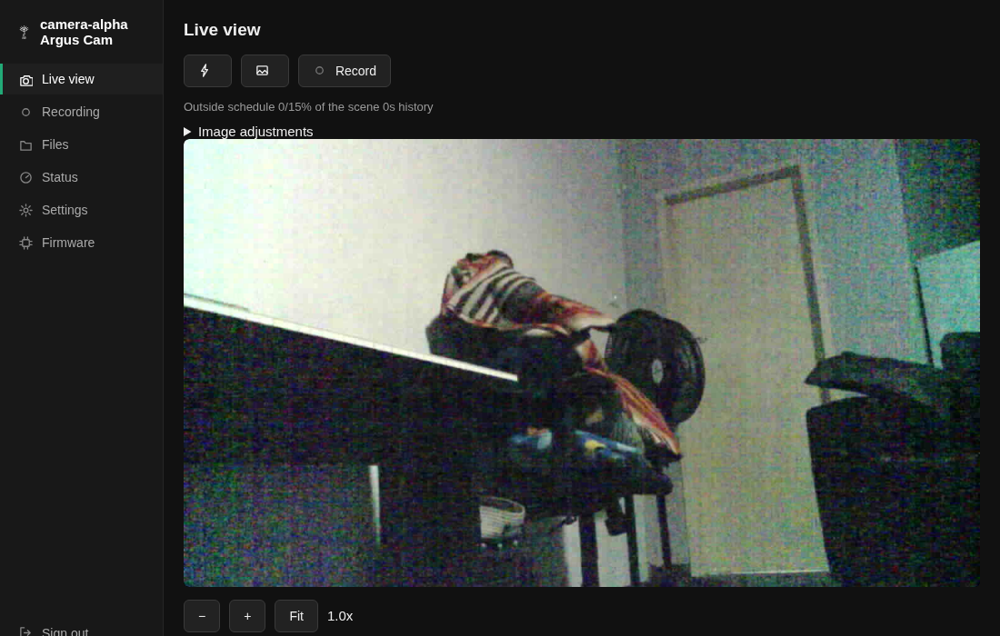

# Argus Cam

Firmware that turns a $8 AI-Thinker ESP32-CAM into a camera that records by itself. It watches for motion, records to its own microSD card, serves live video and its recordings over HTTP, and keeps doing all of that when the network goes away.


No cloud account, no phone app, no vendor. The camera holds its own footage and answers to anything that can speak HTTP.

## What it does

- **Motion-triggered recording** with pre-roll, so the clip starts before the thing that triggered it.
- **Live MJPEG stream** at up to 24fps at 640x480, plus single-frame snapshots.
- **On-device recording browser** with a scrubbable player, per-frame seeking, and download as playable AVI.
- **A web UI on the camera itself**: live view with digital zoom, image adjustment sliders, file browser, status page, settings, firmware upload.
- **A JSON API** covering state, config, recordings, and firmware, so a recorder like [Argus NVR](https://github.com/TheAmbitiousCorry/argus-nvr) can manage a fleet of these.
- **Browser-based setup**: a fresh camera raises its own Wi-Fi network and asks you three questions.
- **Two independent firmware update paths**, with automatic rollback if a new build cannot reach the network.

## What makes it different

Most ESP32 camera projects stream video. This one is built to survive being left alone on a wall.

**Recordings survive a power cut.** Frames are written as concatenated JPEGs plus a text index, not as AVI. An AVI writes its index at the end, so an interrupted recording is an unplayable file. Here a power cut costs you the last frame, and everything before it still plays. AVI is generated on demand when you download a clip, from the index that is already on the card.

**One owner per scarce resource.** The camera has one sensor, one radio, and one SD bus. Two consumers calling for frames at once measured 230 frames captured against 4. So while a recording runs it is the only thing grabbing frames, and it publishes a copy of each frame behind a seqlock for live viewers to read. Watching a recording in progress costs no extra captures.

**A failed update rolls itself back.** A new build boots on trial. It is only marked good once it has reached the network with its web servers answering. A build that boots but cannot get online reverts to the previous slot on the next restart, and the camera tells you it happened.

**You cannot lock yourself out.** GPIO2 is shared between the SD card and the USB boot strap, so a card in the slot blocks USB flashing. That means one recovery path can fail and take flashing with it. So there are always two: USB and network OTA, plus a 15-minute setup access point that reopens after every restart, plus a physical factory reset (tap reset three times in five seconds).

**Numbers, not intuition.** [docs/principles.md](docs/principles.md) is a list of rules, each one paid for by a specific mistake, each with the measurement that produced it. Creating a file costs 142ms against 13ms to append to an open one. Removing one `delay(50)` from the main loop took recording from 16.2 to 24.7fps. Serving a frame took 1384ms until the client started sending the byte offset it already knew, then 127ms.

## What you need

| | |
|---|---|
| Board | AI-Thinker ESP32-CAM (OV2640 sensor, 4MB PSRAM) |
| Programmer | FTDI/USB-TTL adapter at 3.3V, or an ESP32-CAM-MB dock |
| Card | microSD, FAT32. Cards over 32GB usually ship exFAT and must be reformatted |
| Power | **A supply that can actually deliver 5V at 500mA+.** Weak power is the single most common cause of every symptom here: the sensor not detected, Wi-Fi refusing to associate, random resets, boot loops |
| Toolchain | [PlatformIO](https://platformio.org/) |

## Flashing it

```bash
git clone https://github.com/TheAmbitiousCorry/argus-cam.git
cd argus-cam
pio run -t upload          # over USB, on /dev/ttyUSB0
pio device monitor         # 115200 baud
```

Take the SD card out before flashing over USB. GPIO2 is shared between the card and the boot strap, and a card in the slot will stop the board entering download mode.

The build stamps `git describe` into the firmware as its version, which is what the camera reports at `/version` and advertises over mDNS.

Later updates can go over the air instead:

```bash
pio run -e esp32cam_ota -t upload
```

Point `upload_port` at your camera and pass the OTA password in a `platformio.local.ini` (gitignored) rather than editing the tracked file:

```ini
[env:esp32cam_ota]
upload_port = camera-alpha.local
upload_flags = --host_port=45678 --auth=YOUR_OTA_PASSWORD
```

## First boot

1. Power the camera. The status LED blinks fast while it looks for a network.
2. It has no configuration yet, so it raises its own open Wi-Fi network called **`ESP32CAM-Setup-XXXX`** (the last four hex digits of its MAC). Join it.
3. A captive portal opens. If it does not, browse to **`http://192.168.0.1`**.
4. Fill in four things: a camera name, your Wi-Fi network and password, and an admin username and password (8 characters minimum). The name field is pre-filled with a suggestion drawn from the chip's own MAC, so the same board always proposes the same name.
5. Save. The camera restarts and joins your network.
6. Find it at **`http://<the-name-you-chose>.local`** and sign in.

There is no password recovery. If you lose it, tap the reset button three times within five seconds to wipe the configuration and start over.

After every restart the camera also reopens that setup access point for 15 minutes, closing early once the main connection has been healthy for a minute. Joining it does not skip the login: it is a way back onto the camera when your router has moved, not a back door. You can turn it off in Settings.

## Using it

Sign in and you get:

| Page | What it is for |
|---|---|
| `/` | Live view. Pinch or scroll to zoom, fire the flash, start and stop recording, adjust the image with sliders that write to the sensor as you move them |
| `/recording` | Motion sensitivity, clip length, pre-roll, quiet period, day and hour schedule, resolution, JPEG quality, free-space floor |
| `/files` | Browse the card, sort by name, size, or length, play or download recordings, delete in bulk |
| `/play?dir=…` | Scrub through one recording frame by frame, or play it at its true recorded pace |
| `/status` | Sensor state, uptime, signal, reconnect count, viewers, card space, heap and PSRAM, reset presses |
| `/settings` | Name, Wi-Fi, OTA password, timezone, setup-AP window |
| `/update` | Firmware version, running slot, trial state, last rollback, and an upload box |



### Recording behaviour

Motion is measured by decoding each frame at 1/8 scale, reducing it to a 10x8 grid of brightness blocks, and counting how many blocks changed by more than 14 out of 255 since the last check. The **sensitivity** setting is that count as a percentage: at the default of 20, a fifth of the scene has to change. Checks run every 800ms, so movement has to persist for about a second to trigger, which is what stops a passing shadow from filling your card.

When it triggers:

- The last few seconds are already buffered in PSRAM (**pre-roll**, 5s by default) and get written first, so the clip opens before the event.
- Recording runs for at least **`recordSeconds`** (10s by default). That is a minimum, not a cap.
- Every second, if the scene is still moving, the end is pushed back by **`quietSeconds`** (5s). The clip ends when things go still, not when a timer expires.
- A hard ceiling of 5 minutes stops continuous traffic producing one endless file.
- Afterwards there is a 4-second cooldown so the tail of one event does not immediately re-trigger the next.

Clips land in `/rec/YYYY-MM-DD/HHMMSS/` as `video.mjpeg` plus `index.txt` (one line per frame: offset, length, timestamp). Before the clock has synced over NTP there are no dates to use, so recordings go to `/rec/1`, `/rec/2` and so on instead.

When free space drops below **`keepFreeMb`** (512MB by default), the oldest day is deleted first, up to 20 recordings per pass. Set it to 0 to disable that and let the card fill.

Capture is capped at 25fps regardless of what the card can take, because 25fps fills 30GB in about 22 hours.

### Streaming

`http://<camera>/` for pages and the API, `http://<camera>:81/stream` for video. **Three concurrent viewers**, across live and replay together. A fourth gets an immediate `503` rather than a connection that hangs. Two viewers at once roughly halve each other's frame rate, since there is one radio.

### If there is no card

Recording still runs, it just writes nothing. State stays correct (`active`, timings, and the `cardless` flag at `/record`), so a recorder watching the live stream can record on the camera's behalf. That is how Argus NVR covers a camera whose card died.

## API

Everything is behind the session cookie from `POST /login`. Page routes redirect to `/login` when signed out; API routes return `401`.

```bash
# sign in, keep the cookie
curl -c jar -d 'user=admin&pass=YOURPASS' http://camera-alpha.local/login

# what is it doing right now
curl -b jar http://camera-alpha.local/record

# grab a still
curl -b jar -o still.jpg 'http://camera-alpha.local/capture?flash=1'

# what days have recordings
curl -b jar http://camera-alpha.local/recordings/days

# download one as a playable AVI
curl -b jar -o clip.avi 'http://camera-alpha.local/video?dir=/rec/2026-08-30/213155'
```

### Reference

| Method | Path | Returns |
|---|---|---|
| `POST` | `/login` | Sets `sid` cookie. Form: `user`, `pass` |
| `GET` | `/logout` | Ends the session |
| `GET` | `/version` | `{mac, version, built, slot, onTrial, rolledBackFrom}` |
| `GET` | `/config` | Every setting as JSON, plus `storage`, live `aelnow`/`gcnow`, and `unsupported` |
| `GET` | `/record` | Live state: `active, frames, fps, triggered, motion, armed, change, threshold, preFrames, lux, rung, storage, cardless` |
| `POST` | `/record` | Toggles recording |
| `POST` | `/image` | Applies sensor settings live. Form: `autoimg, ael, gc, bri, con, sat, wb, flashlvl, gray, hmir, vflip`. Replies `ok`, or a list of controls the sensor refused |
| `POST` | `/recording` | Motion, schedule, resolution, quality, retention. Applied without a reboot |
| `POST` | `/settings` | Name, Wi-Fi, OTA password, timezone. Reboots |
| `GET` | `/capture` | One JPEG. `?flash=1` fires the LED |
| `GET` | `:81/stream` | MJPEG, `multipart/x-mixed-replace`, boundary `espcamframeboundary` |
| `GET` | `:81/playstream?dir=&from=` | Replays a recording at its recorded pace, same framing |
| `GET` | `/recordings/days` | `{days, loose, more}` |
| `GET` | `/recordings?day=YYYY-MM-DD` | `{day, recordings:[{at,durMs,bytes,frames}], more}` |
| `GET` | `/recindex?dir=` | Frame index as `[[atMs, offset, length], …]` |
| `GET` | `/frame?dir=&off=&len=` | One JPEG read straight at that offset |
| `GET` | `/video?dir=` | The recording muxed into AVI on the fly |
| `GET` | `/download?path=` | Any file on the card, chunked |
| `POST` | `/files` | Deletes. Body: repeated `f=<path>` |
| `POST` | `/update` | Raw firmware bytes with `Content-Length`. Flashes and reboots |
| `GET` | `/networks` | Nearby Wi-Fi as `[{s, r}]` |
| `GET` | `/sdbench` | Times small-file against single-file writes on this card |

The camera holds 12 sessions and evicts the oldest, and those are shared with anyone browsing its UI. Sessions last 12 hours and survive a reboot. Poll `/record` no faster than every couple of seconds: an HTTP round trip can take 3 seconds when the camera is busy, so timeouts under 10 seconds will report a healthy camera as offline.

### Being found

The camera advertises `_http._tcp` on port 80 as `<name>.local`, with TXT records `argus=cam` and `fw=<version>`. The tag matters: everything with a web server answers `_http._tcp`, and the tag is how a recorder tells a camera from your router.

## Settings

| Setting | Default | Range |
|---|---|---|
| `motionEnabled` | off | |
| `motionSensitivity` | 20 | 1-100 (% of blocks changed) |
| `recordSeconds` | 10 | minimum clip length |
| `prerollSeconds` | 5 | seconds buffered before the trigger |
| `quietSeconds` | 5 | stillness needed to end a clip |
| `keepFreeMb` | 512 | 0 disables auto-delete |
| `scheduleEnabled` | off | needs a synced clock; without one, motion stays armed |
| `scheduleFromHour` / `scheduleToHour` | 22 / 6 | 0-23, wraps midnight |
| `scheduleDays` | every day | bitmask, Sunday is bit 0 |
| `frameSize` | SVGA (800x600) | QVGA to UXGA. Changing it restarts the sensor |
| `jpegQuality` | 12 | 10 (best) to 63 |
| `autoImage` | on | camera drives exposure and gain itself |
| `aeLevel` | 0 | -2 to 2 |
| `gainCeiling` | 0 | 0-6, mapping to 2x through 128x |
| `brightness` / `contrast` / `saturation` | 0 | -2 to 2 each |
| `wbMode` | auto | auto, sunny, cloudy, office, home |
| `grayscale`, `hmirror`, `vflip` | off | |
| `flashLevel` | 60 | 0-255. Capped at 1.5s on, the LED has no heatsink |
| `apWindow` | on | reopen the setup AP for 15 min after each restart |
| `timezone` | UTC0 | POSIX TZ string, e.g. `SAST-2` |

Auto-exposure is a 10-rung ladder rather than the sensor's own loop. It targets mid-grey 110/255 with a wide deadband, spends exposure compensation before it spends gain, sheds gain before it sheds exposure, and needs two readings in the same direction before it moves, so someone walking past the lens does not make it hunt.

## Status LED

The LED on GPIO33 is the only output you get before the network works.

| Pattern | Meaning |
|---|---|
| Solid | Booting |
| Fast blink | Looking for Wi-Fi, or waiting in setup mode |
| Brief flash every 3s | Online, servers answering |
| Double blink | On the network, but the camera sensor did not respond |

## Known constraints

- **1-bit SD mode only.** 4-bit needs GPIO4 (the flash LED) and GPIO12 (a boot strap pin that blocks boot if it reads high). Both are already spoken for on this board.
- **The firmware never formats a card.** A card it cannot read is reported as such rather than wiped.
- **No HTTPS.** This is a LAN device on plain HTTP. The session cookie is `HttpOnly` and `SameSite=Lax` but deliberately not `Secure`.
- **Failed logins cost 1.2 seconds** and that is the whole of the brute-force defence. Do not expose this to the internet.
- **OTA over espota uses MD5**, which is weaker than the PBKDF2 hash guarding the web login. That is the protocol's design, not a choice made here.
- **Partition layout is `min_spiffs.csv`**, two 1.875MB app slots. Changing it later means erasing the device.

## Licence

MIT. See [LICENSE](LICENSE).
